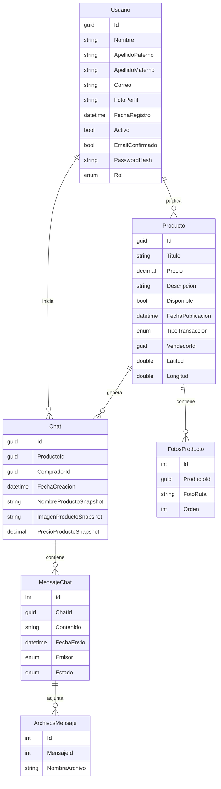

# API NetCore Para Sistema de Marketplace
Esta api formó parte de un proyecto universitario, del cual, esta API tiene el objetivo de ser el *Backend*. Dicho proyecto también es constituido por un Sitio Web y una Aplicación Movil que consumiran la API que aqui se publica.

## Caracteristicas de esta API
### Autenticación
Para la autenticación de usuarios es utilizado el sistema JWT, que genera un token de autenticación único cada vez que un usuario inicia sesión. Para utilizar la mayoria de endpoints de esta api, es requerido un token válido que viaje junto a la peticion a los endpoints. El token es proporcionado por la API al iniciar sesión.

### Base de Datos
1. Como SGBD se hace uso de Microsoft SQL Server.
1. La estructura de Base de Datos se creó bajo el concepto de Code First, haciendo uso de Enity Framework para Asp Net Core

#### Diagrama ER Sobre la Base de Datos
